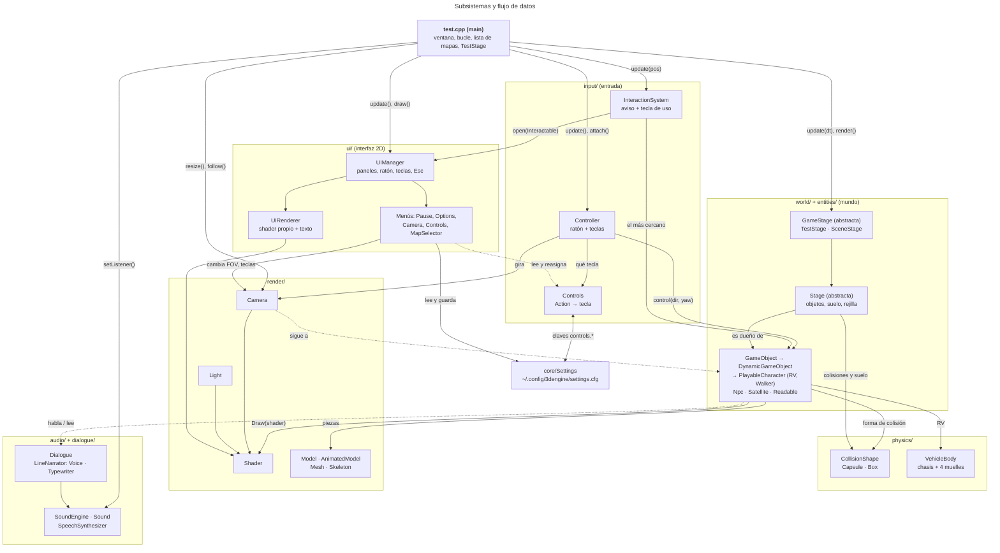
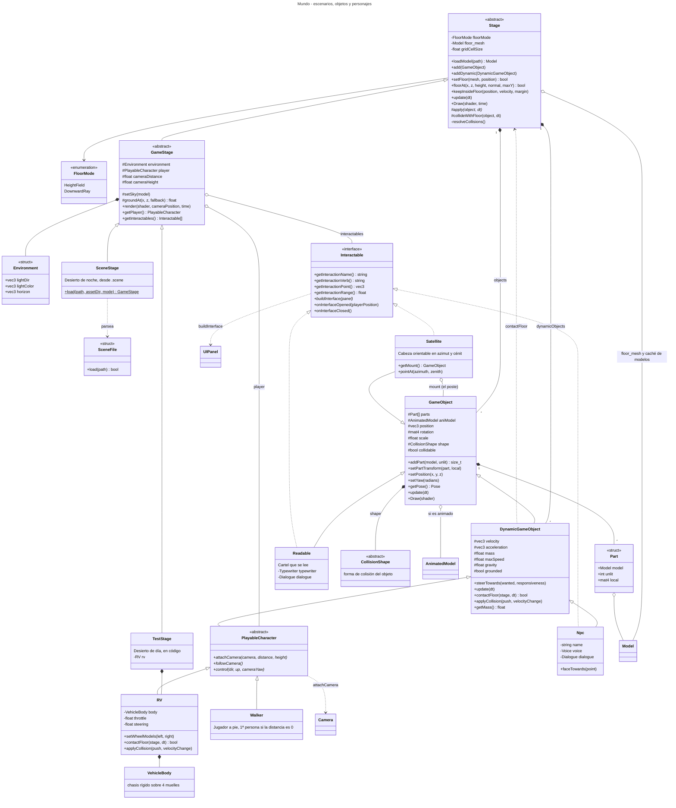
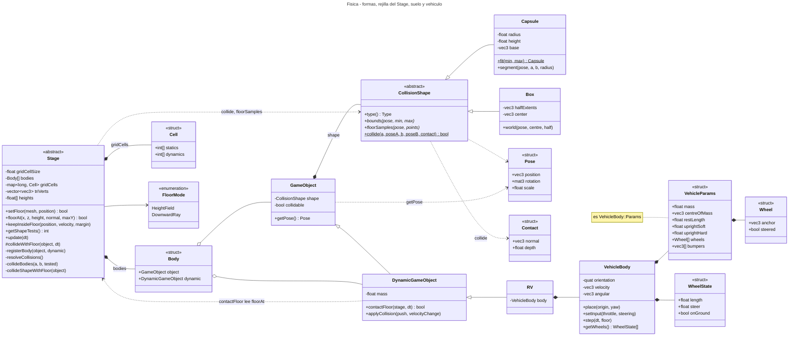
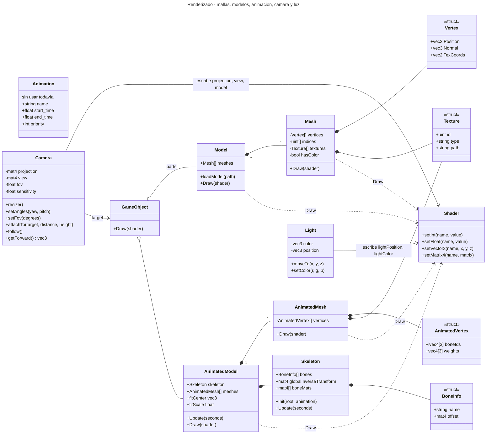
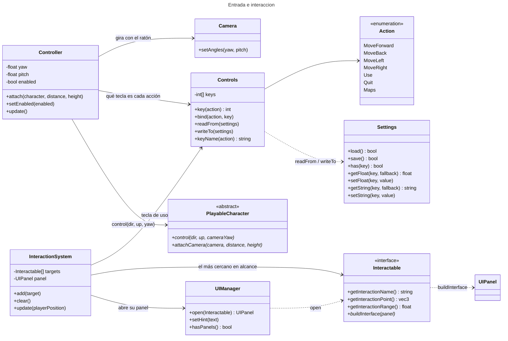
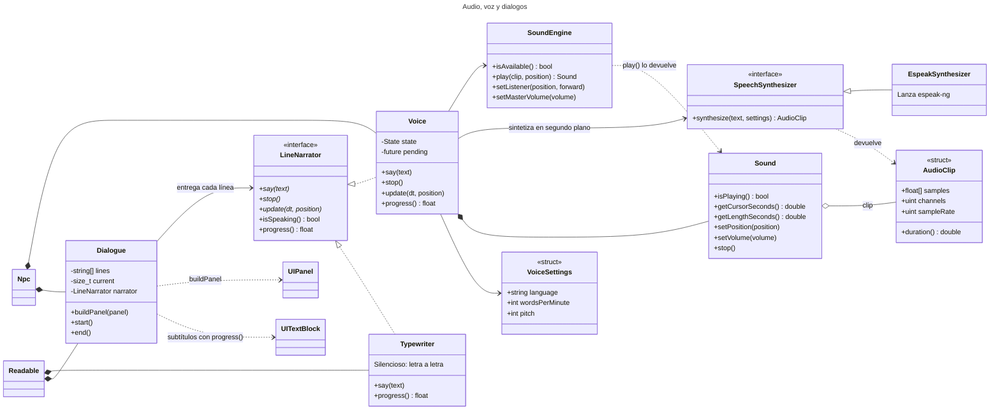
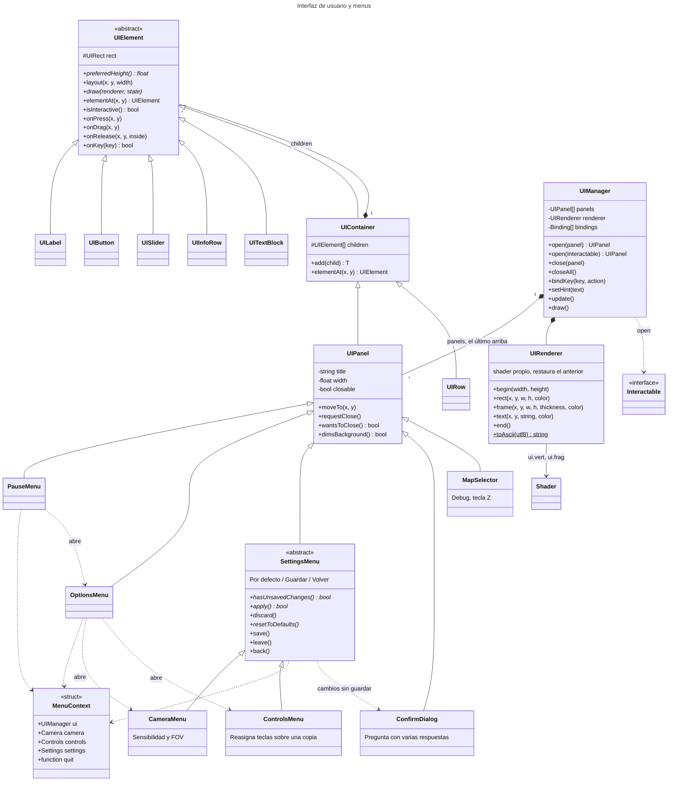
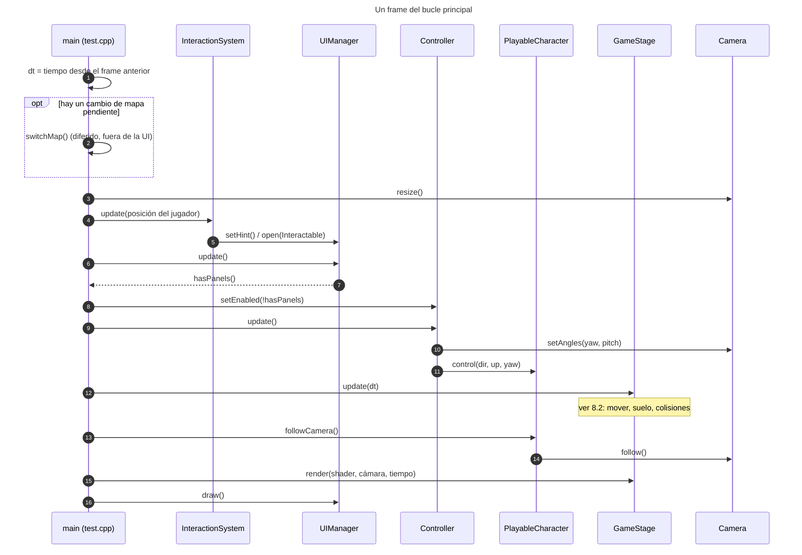
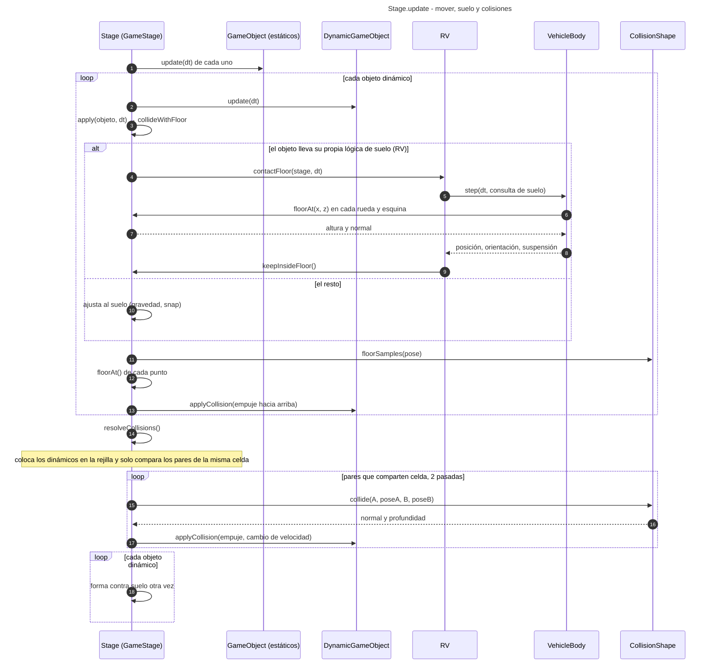
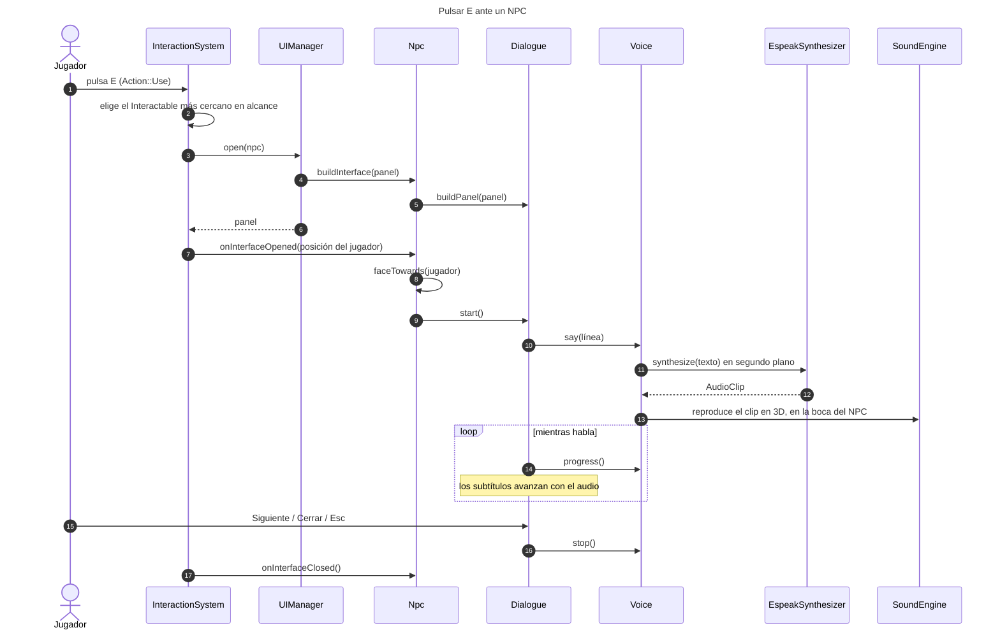

# Diagramas UML y visión general del proyecto

Este documento resume cómo encajan las clases del proyecto. Los diagramas están en [Mermaid](https://mermaid.js.org/), que **GitHub dibuja directamente** en el navegador (también VS Code con la extensión "Markdown Preview Mermaid Support"). Los detalles de cada módulo están en [ARCHITECTURE.md](ARCHITECTURE.md).

Se leen de lo general a lo concreto:

1. [Vista general](#1-vista-general): subsistemas y cómo se hablan entre sí.
2. [Mundo](#2-mundo-escenarios-y-objetos): escenarios, objetos, personajes y objetos usables.
3. [Física y colisiones](#3-física-y-colisiones): formas de colisión, rejilla del `Stage` y el vehículo.
4. [Renderizado](#4-renderizado): mallas, modelos, animación, cámara y luz.
5. [Entrada e interacción](#5-entrada-e-interacción).
6. [Audio y diálogos](#6-audio-y-diálogos).
7. [Interfaz de usuario y menús](#7-interfaz-de-usuario-y-menús).
8. [Secuencias](#8-secuencias): un frame, la física de un frame y una conversación.
9. [Índice de todas las clases](#9-índice-de-todas-las-clases).

**Imágenes.** Cada diagrama también está exportado como PNG en [`docs/diagrams/`](diagrams/), por si no tienes un visor de Mermaid:

| Diagrama | Imagen |
|---|---|
| 1. Vista general | [`01-vista-general.png`](diagrams/01-vista-general.png) |
| 2. Mundo | [`02-mundo.png`](diagrams/02-mundo.png) |
| 3. Física y colisiones | [`03-fisica-y-colisiones.png`](diagrams/03-fisica-y-colisiones.png) |
| 4. Renderizado | [`04-renderizado.png`](diagrams/04-renderizado.png) |
| 5. Entrada e interacción | [`05-entrada-e-interaccion.png`](diagrams/05-entrada-e-interaccion.png) |
| 6. Audio y diálogos | [`06-audio-y-dialogos.png`](diagrams/06-audio-y-dialogos.png) |
| 7. Interfaz y menús | [`07-interfaz-y-menus.png`](diagrams/07-interfaz-y-menus.png) |
| 8.1 Un frame | [`08a-secuencia-un-frame.png`](diagrams/08a-secuencia-un-frame.png) |
| 8.2 La física de un frame | [`08b-secuencia-fisica.png`](diagrams/08b-secuencia-fisica.png) |
| 8.3 Hablar con un NPC | [`08c-secuencia-hablar-con-npc.png`](diagrams/08c-secuencia-hablar-con-npc.png) |

La imagen de la vista general (la que da una idea de todo el proyecto de un vistazo) es la primera.

**Leyenda de las flechas** (en los diagramas de clases):

| Flecha | Significa |
|---|---|
| `A <\|-- B` | `B` hereda de `A` |
| `A <\|.. B` | `B` implementa la interfaz `A` (herencia múltiple de una clase abstracta pura) |
| `A *-- B` | `A` es dueña de `B` (composición: `B` vive y muere con `A`) |
| `A o-- B` | `A` guarda una referencia o un puntero compartido a `B`, pero no es la única dueña (agregación) |
| `A --> B` | `A` usa `B` de forma estable (puntero o referencia que guarda) |
| `A ..> B` | `A` depende de `B` solo en una llamada o en un parámetro |

Las clases marcadas `<<abstract>>` no se pueden instanciar; `<<interface>>` son clases abstractas puras; `<<enumeration>>` son enumeraciones; `<<struct>>` son datos sin lógica.

## 1. Vista general

`main` (`src/test.cpp`) crea la ventana y los sistemas globales (cámara, controles, interfaz, sonido, luz) y ejecuta el bucle. Todo lo que es contenido del juego vive en un **`GameStage`** (un mapa), que `main` puede cambiar en marcha.

Reglas que sostienen el diseño:

- **`Stage` manda sobre los objetos y `GameStage` sobre el mapa.** Nada fuera del mapa guarda punteros a sus objetos sin limpiarlos en `switchMap`.
- **`Controls` es la única fuente de teclas** y `UIManager` el único dueño del callback de teclado.
- **Un solo shader de mundo** (`shaders/animatedshader.vert` + `shader.frag`); la interfaz usa el suyo (`ui.vert`/`ui.frag`).

## 2. Mundo: escenarios y objetos

Un **`Stage`** es un nivel: es dueño de sus `GameObject` (estáticos) y `DynamicGameObject` (que se mueven), tiene el suelo y la rejilla de colisiones. Es abstracto: cada escenario implementa `apply(objeto, dt)`, la regla que se aplica a cada objeto dinámico justo después de moverse. **`GameStage`** lo convierte en un mapa jugable (entorno, cielo, jugador, cámara, interactuables) y **`TestStage`** / **`SceneStage`** son los dos mapas concretos.

Cómo se usa:

- **`GameObject`** se dibuja a sí mismo: `Draw(shader)` fija `objposition` y `objrotation` y dibuja cada pieza (`Part`), que puede tener su propia transformación local (las ruedas del RV).
- **`DynamicGameObject`** añade velocidad, masa y gravedad. Quien lo controla (el `Controller` o una IA) **no cambia su posición**: lo guía con aceleración (`steerTowards`) y el `Stage` lo mueve en `update(dt)`.
- **`PlayableCharacter`** es el personaje que maneja el `Controller`. Cada hijo decide cómo responde a la entrada y cómo lo sigue la cámara: `Walker` anda en la dirección de la cámara; `RV` se conduce como un coche (W/S acelera, A/D gira).
- **`Interactable`** es una interfaz: los objetos que el jugador puede usar la implementan junto a su clase de objeto (`Npc`, `Satellite`, `Readable`).

## 3. Física y colisiones

Tres piezas colaboran. **Las formas** (`CollisionShape`) describen el volumen de cada objeto; la **rejilla del `Stage`** decide qué pares hay que comparar; y el **suelo** mantiene los objetos encima del terreno. El RV añade **`VehicleBody`**, su propia simulación de chasis y suspensión.

**Un frame de física** (detalle en el [diagrama de secuencia](#82-la-física-de-un-frame)):

1. Cada objeto dinámico avanza (`update(dt)`) y el escenario le aplica `apply()`, que llama a `collideWithFloor`. Si el objeto lleva su propia lógica de suelo (`contactFloor`), como el RV con su suspensión, el `Stage` se la deja.
2. **Forma contra suelo:** los puntos más bajos de la forma (`floorSamples`: esquinas y la cara más baja de una caja, el punto más bajo de una cápsula) no pueden quedar bajo el suelo, **de cualquier lado que esté boca arriba**. Se empuja el objeto hacia arriba con `applyCollision`.
3. **Forma contra forma:** el `Stage` coloca cada objeto dinámico en la rejilla (celdas de 8 m) y **solo compara los pares que comparten celda**. Un choque separa los objetos: se mueve solo el dinámico contra uno estático, y entre dos dinámicos se mueve más el más ligero (`getMass`). Se quita la velocidad con la que se acercaban, sin rebote. Son dos pasadas.
4. Se repite la comprobación del suelo, por si el empujón metió algo en el terreno.

**Suelo:** `FloorMode::HeightField` interpola una rejilla regular de alturas (O(1), no admite voladizos). `FloorMode::DownwardRay` lanza un rayo vertical contra los triángulos, indexados en otra rejilla (admite cualquier malla). Se elige al crear el `Stage` y no cambia.

**`VehicleBody`** (el RV) es un cuerpo rígido con un centro de masas bajo las ruedas. Cada rueda cuelga de un muelle con amortiguador y recorrido limitado; el neumático da tracción, freno y agarre lateral. Sus esquinas del chasis son puntos de contacto elásticos con rozamiento. Un par de autoenderezado ("tentetieso") lo devuelve siempre a apoyarse en las ruedas.

## 4. Renderizado

`Shader` es el punto de unión: la cámara, la luz y cada malla escriben sus uniforms en él. Hay un solo programa para el mundo; el contrato de uniforms está en [ARCHITECTURE.md](ARCHITECTURE.md#contrato-del-shader).

## 5. Entrada e interacción

El bucle del `main` hace `controller.setEnabled(!ui.hasPanels())`: con cualquier panel abierto los controles están en pausa y el cursor queda libre. `InteractionSystem` solo abre un panel cuando no hay otro.

## 6. Audio y diálogos

`Dialogue` no sabe si el texto se habla o se lee: delega en un `LineNarrator`. `Voice` (con voz, para los `Npc`) y `Typewriter` (en silencio, para los `Readable`) lo implementan, y `progress()` hace que los subtítulos avancen al ritmo de la entrega. El oyente de `SoundEngine` sigue a la cámara cada frame.

## 7. Interfaz de usuario y menús

`UIManager` es el **único dueño** del callback de teclado de GLFW. Reparte las teclas al panel de arriba (`onKey`); Esc cierra ese panel y, sin paneles, abre la pausa. Todos los menús son `UIPanel` y reciben un `MenuContext` con lo que necesitan (la interfaz, la cámara, los controles, los ajustes y cómo salir).

## 8. Secuencias

### 8.1 Un frame

### 8.2 La física de un frame

### 8.3 Hablar con un NPC

## 9. Índice de todas las clases

Generado a partir de las cabeceras de `src/`. La última columna es la sección donde aparece la clase (un `—` en *Hereda de* significa que no tiene clase base). Los tipos auxiliares que viven dentro de otra clase (`Part`, `VehicleBody::Params`, `Stage::Body`…) se ven en el diagrama de su clase.

| Clase | Fichero | Hereda de | Sección |
|---|---|---|---|
| `Npc` | `src/entities/Npc.h` | `DynamicGameObject`, `Interactable` | 2 |
| `RV` | `src/entities/RV.h` | `PlayableCharacter` | 2 |
| `Readable` | `src/entities/Readable.h` | `GameObject`, `Interactable` | 2 |
| `Satellite` | `src/entities/Satellite.h` | `GameObject`, `Interactable` | 2 |
| `Walker` | `src/entities/Walker.h` | `PlayableCharacter` | 2 |
| `TestStage` | `src/test.cpp` | `GameStage` | 2 |
| `DynamicGameObject` | `src/world/DynamicGameObject.h` | `GameObject` | 2 |
| `GameObject` | `src/world/GameObject.h` | — | 2 |
| `Environment` | `src/world/GameStage.h` | — | 2 |
| `GameStage` | `src/world/GameStage.h` | `Stage` | 2 |
| `Interactable` | `src/world/Interactable.h` | — | 2 |
| `PlayableCharacter` | `src/world/PlayableCharacter.h` | `DynamicGameObject` | 2 |
| `Effect` | `src/world/SceneFile.h` | — | 2 |
| `SceneFile` | `src/world/SceneFile.h` | — | 2 |
| `SceneObject` | `src/world/SceneFile.h` | — | 2 |
| `SceneStage` | `src/world/SceneStage.h` | `GameStage` | 2 |
| `FloorMode` | `src/world/Stage.h` | — | 2 |
| `Stage` | `src/world/Stage.h` | — | 2 |
| `Box` | `src/physics/CollisionShape.h` | `CollisionShape` | 3 |
| `Capsule` | `src/physics/CollisionShape.h` | `CollisionShape` | 3 |
| `CollisionShape` | `src/physics/CollisionShape.h` | — | 3 |
| `Contact` | `src/physics/CollisionShape.h` | — | 3 |
| `Pose` | `src/physics/CollisionShape.h` | — | 3 |
| `VehicleBody` | `src/physics/VehicleBody.h` | — | 3 |
| `AnimatedMesh` | `src/render/AnimatedMesh.h` | — | 4 |
| `AnimatedVertex` | `src/render/AnimatedMesh.h` | — | 4 |
| `AnimatedModel` | `src/render/AnimatedModel.h` | — | 4 |
| `Animation` | `src/render/Animation.h` | — | 4 |
| `Camera` | `src/render/Camera.h` | — | 4 |
| `Light` | `src/render/Light.h` | — | 4 |
| `Mesh` | `src/render/Mesh.h` | — | 4 |
| `Texture` | `src/render/Mesh.h` | — | 4 |
| `Vertex` | `src/render/Mesh.h` | — | 4 |
| `Model` | `src/render/Model.h` | — | 4 |
| `Shader` | `src/render/Shader.h` | — | 4 |
| `BoneInfo` | `src/render/Skeleton.h` | — | 4 |
| `Skeleton` | `src/render/Skeleton.h` | — | 4 |
| `Settings` | `src/core/Settings.h` | — | 5 |
| `Controller` | `src/input/Controller.h` | — | 5 |
| `Action` | `src/input/Controls.h` | — | 5 |
| `Controls` | `src/input/Controls.h` | — | 5 |
| `InteractionSystem` | `src/input/InteractionSystem.h` | — | 5 |
| `AudioClip` | `src/audio/AudioClip.h` | — | 6 |
| `EspeakSynthesizer` | `src/audio/EspeakSynthesizer.h` | `SpeechSynthesizer` | 6 |
| `Sound` | `src/audio/SoundEngine.h` | — | 6 |
| `SoundEngine` | `src/audio/SoundEngine.h` | — | 6 |
| `SpeechSynthesizer` | `src/audio/SpeechSynthesizer.h` | — | 6 |
| `VoiceSettings` | `src/audio/SpeechSynthesizer.h` | — | 6 |
| `Voice` | `src/audio/Voice.h` | `LineNarrator` | 6 |
| `Dialogue` | `src/dialogue/Dialogue.h` | — | 6 |
| `LineNarrator` | `src/dialogue/LineNarrator.h` | — | 6 |
| `Typewriter` | `src/dialogue/Typewriter.h` | `LineNarrator` | 6 |
| `CameraMenu` | `src/ui/CameraMenu.h` | `SettingsMenu` | 7 |
| `ConfirmDialog` | `src/ui/ConfirmDialog.h` | `UIPanel` | 7 |
| `ControlsMenu` | `src/ui/ControlsMenu.h` | `SettingsMenu` | 7 |
| `MapSelector` | `src/ui/MapSelector.h` | `UIPanel` | 7 |
| `MenuContext` | `src/ui/MenuContext.h` | — | 7 |
| `OptionsMenu` | `src/ui/OptionsMenu.h` | `UIPanel` | 7 |
| `PauseMenu` | `src/ui/PauseMenu.h` | `UIPanel` | 7 |
| `SettingsMenu` | `src/ui/SettingsMenu.h` | `UIPanel` | 7 |
| `UIButton` | `src/ui/UIButton.h` | `UIElement` | 7 |
| `UIContainer` | `src/ui/UIContainer.h` | `UIElement` | 7 |
| `UIElement` | `src/ui/UIElement.h` | — | 7 |
| `UIInfoRow` | `src/ui/UIInfoRow.h` | `UIElement` | 7 |
| `UILabel` | `src/ui/UILabel.h` | `UIElement` | 7 |
| `UIManager` | `src/ui/UIManager.h` | — | 7 |
| `UIPanel` | `src/ui/UIPanel.h` | `UIContainer` | 7 |
| `UIRenderer` | `src/ui/UIRenderer.h` | — | 7 |
| `UIRow` | `src/ui/UIRow.h` | `UIContainer` | 7 |
| `UISlider` | `src/ui/UISlider.h` | `UIElement` | 7 |
| `UITextBlock` | `src/ui/UITextBlock.h` | `UIElement` | 7 |

## Cómo mantener este documento

- Si añades una clase, ponla en el diagrama de su subsistema (con sus relaciones, no hace falta listar todos los miembros) y en el índice.
- Si cambias una herencia, un dueño (`*--`) o una dependencia importante, actualiza la flecha. Es lo que más se desfasa.
- **Los PNG de `docs/diagrams/` hay que regenerarlos** cuando cambie un diagrama: son una copia del bloque Mermaid. Se hace con mermaid-cli (`mmdc -p cfg.json -i bloque.mmd -o imagen.png -s 2`; ver `CLAUDE.md`).
- Los diagramas son texto: se editan a mano y se ven en GitHub. Para comprobar que la sintaxis es válida antes de subir el cambio, se puede pasar cada bloque por el parser de Mermaid (`mermaid.parse`).
