# UML diagrams and project overview

This document summarises how the project's classes fit together. The diagrams are written in [Mermaid](https://mermaid.js.org/), which **GitHub renders directly** in the browser (VS Code too, with the "Markdown Preview Mermaid Support" extension). The details of each module are in [ARCHITECTURE.md](ARCHITECTURE.md).

They read from the general to the specific:

1. [Overview](#1-overview): subsystems and how they talk to each other.
2. [World](#2-world-stages-and-objects): stages, objects, characters and usable objects.
3. [Creatures and encounters](#3-creatures-and-encounters): the night creatures, Bob and his saucer, safe spaces.
4. [Physics and collisions](#4-physics-and-collisions): collision shapes, the `Stage` grid and the vehicle.
5. [Rendering](#5-rendering): meshes, models, animation, camera, lights and effects.
6. [Input and interaction](#6-input-and-interaction).
7. [Audio and dialogue](#7-audio-and-dialogue).
8. [User interface and menus](#8-user-interface-and-menus).
9. [Sequences](#9-sequences): one frame, one frame of physics, a conversation, and getting in and out of the RV.
10. [Index of all classes](#10-index-of-all-classes).

**Images.** The PNG exports in [`docs/diagrams/`](diagrams/) are copies of the *previous* (Spanish) version of the diagrams and have **not** been regenerated for this revision. The Mermaid blocks in this file are the source of truth.

**Arrow legend** (class diagrams):

| Arrow | Meaning |
|---|---|
| `A <\|-- B` | `B` inherits from `A` |
| `A <\|.. B` | `B` implements the interface `A` (multiple inheritance from a pure abstract class) |
| `A *-- B` | `A` owns `B` (composition: `B` lives and dies with `A`) |
| `A o-- B` | `A` keeps a reference or shared pointer to `B` but is not its only owner (aggregation) |
| `A --> B` | `A` uses `B` in a lasting way (a pointer or reference it stores) |
| `A ..> B` | `A` depends on `B` only through a call or a parameter |

Classes marked `<<abstract>>` cannot be instantiated; `<<interface>>` are pure abstract classes; `<<enumeration>>` are enums; `<<struct>>` are plain data.

## 1. Overview

`main` (`src/test.cpp`) creates the window and the global systems (camera, controls, UI, sound, light) and runs the loop. All game content lives in a **`GameStage`** (a map) that `main` can swap while running. Maps are listed in `main()` (name + factory) and chosen with the debug selector (Z) or `--map`.

Most maps are a **`VehicleStage`**: it adds the RV, the penguin on foot, the day/night cycle and the night creatures. The five maps are: the daytime desert (`TestStage`), the road forest (`ForestStage`), the pine forest (`PineForestStage`), Route 66 (`Route66Stage`) and the night desert (`SceneStage`, loaded from a `.scene` file).

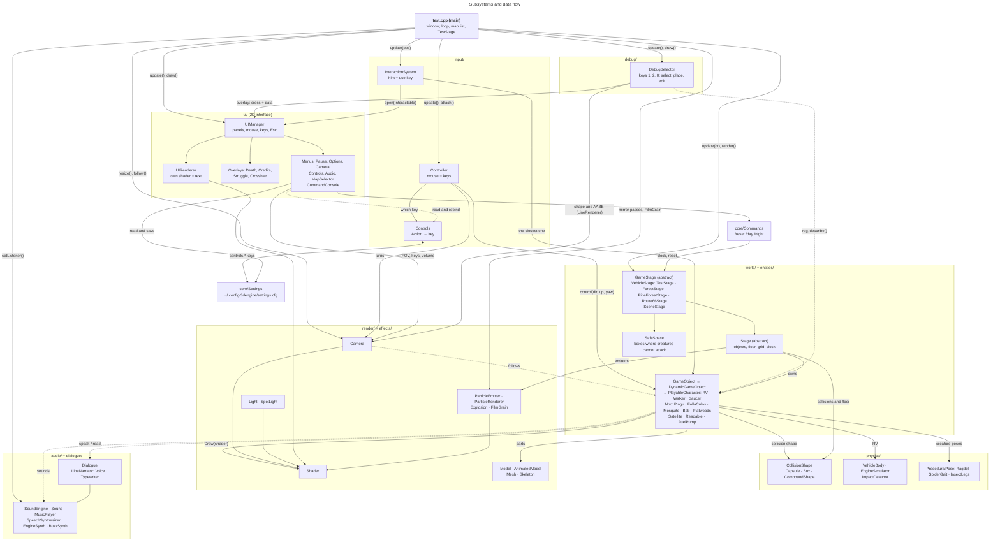

Rules that hold the design together:

- **`Stage` rules the objects and `GameStage` rules the map.** Nothing outside the map keeps pointers to its objects without clearing them in `switchMap` (always deferred through `requestedMap`, never called from a UI callback).
- **`Controls` is the only source of keys** and `UIManager` the only owner of the keyboard callback. Every game function is an `Action`.
- **One world shader** (`shaders/animatedshader.vert` + `shader.frag`); the UI uses its own (`ui.vert`/`ui.frag`), and there are separate ones for particles, debug lines and film grain.
- **`main` is the other person's code**: our classes inherit from theirs, not the other way round.

## 2. World: stages and objects

A **`Stage`** is a level: it owns its `GameObject`s (static) and `DynamicGameObject`s (moving), holds the floor, the collision grid and the day clock. It is abstract: each stage implements `apply(object, dt)`, the rule applied to every dynamic object right after it moves. **`GameStage`** turns it into a playable map (environment, sky, player, camera, interactables) and **`VehicleStage`** adds the RV, the player on foot, the light cycle and the creatures. The concrete maps inherit from it.

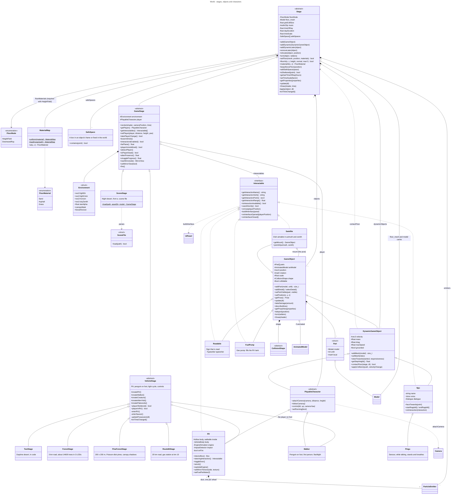

How it is used:

- **`GameObject`** draws itself: `Draw(shader)` sets `objposition` and `objrotation` and draws every `Part`, each with its own local transform (the RV's wheels, doors and needles). `addDetail`/`selectDetail` give a tree several levels of detail. `takeDamage` does nothing by default; creatures override it so the saucer's gun can hurt them.
- **`DynamicGameObject`** adds velocity, mass and gravity. Whoever drives it (the `Controller` or an AI) **does not change its position**: it steers with acceleration (`steerTowards`) and the `Stage` moves it in `update(dt)`. To move an object of a stage use `Stage::relocate` / `turn`, never `setPosition`.
- **`PlayableCharacter`** is what the `Controller` drives. `Walker` walks relative to the camera; `RV` drives like a car; `Saucer` flies (see [section 3](#3-creatures-and-encounters)).
- **`Interactable`** is an interface implemented next to the object class. By default using one opens a panel; the `RV` is used directly (`usesDirectly`): the `RV` itself is the **door** and `RV::steeringInteraction()` the **steering wheel** (see [9.4](#94-getting-in-and-out-of-the-rv)).
- **Map change of player.** `setPlayer`/`takePlayerChange` let a stage hand the `Controller` a different character (on foot ↔ RV ↔ saucer).

## 3. Creatures and encounters

The night creatures are created by `VehicleStage`. They never attack a player who is *sheltered* (`playerSheltered()`: driving the RV, piloting the saucer or standing inside a `SafeSpace`), and behave as if the player were in a vehicle.

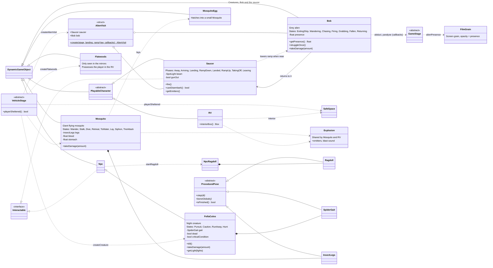

- **`FollaCulos`** runs at the player at night (4.34 m/s) and flees by day; with the player in the RV it circles at 22 m without entering. It hunts other `Npc`s (devours them as a ragdoll) and dies in a hard crash, sticking to the windscreen when hit head-on.
- **`Mosquito`** attacks at dawn and dusk and otherwise looks for water to lay eggs (`MosquitoEgg`). It siphons fuel, can puncture a tyre and bites to the death. It is killed by an external hit above 5 m/s or by two ray-gun shots.
- **`Bob` and the `Saucer`** come only at night (`AlienVisit::create` builds both for any map). Bob wanders by the ship, chases a player on foot, can paralyse them with a yellow eye beam, grab them (button-mash Left Shift to break free) or abduct them. With the ramp down the player can board and **pilot the saucer** (it is a `PlayableCharacter`), and take out a ray gun with F (left click fires: `GameStage::fire` → `Saucer::fire` → `GameObject::takeDamage`).
- **`Flatwoods`** only appears in the rear-view mirrors (`GameStage::setMirrorView`) and only if the player is *in* the RV (`SafeSpace` does not protect). If it catches up it possesses the player: lets go of the RV, opens the door and puts the player out; Left Shift frees them.
- **`ProceduralPose`** is the base for poses generated by code (no animation file): `Ragdoll` (Verlet), `SpiderGait` (four-legged gait with IK) and `InsectLegs`.
- **Presence.** `Bob::getPresence` (higher when he looks at you and approaches, maximal during the abduction) drives the hiss volume and the `FilmGrain` opacity.

## 4. Physics and collisions

Three pieces cooperate. **The shapes** (`CollisionShape`) describe each object's volume; the **`Stage` grid** decides which pairs to compare; and the **floor** keeps objects above the terrain. The RV adds **`VehicleBody`**, its own chassis and suspension simulation.

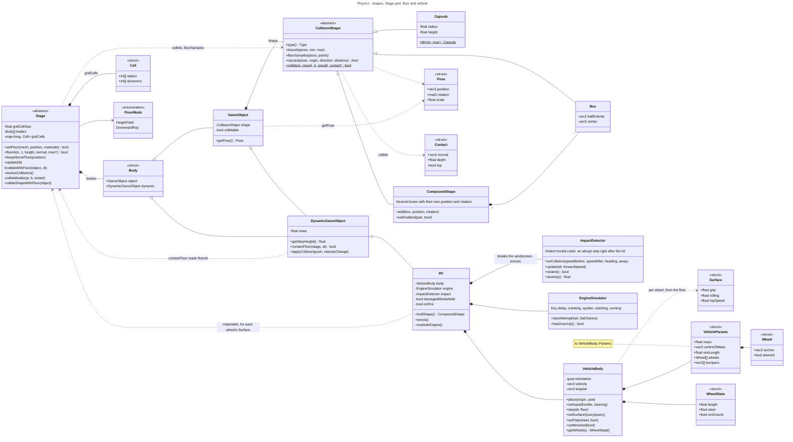

**One frame of physics** (detail in the [sequence diagram](#92-one-frame-of-physics)):

1. Every dynamic object advances (`update(dt)`) and the stage applies `apply()`, which calls `collideWithFloor`. If the object has its own floor logic (`contactFloor`), like the RV with its suspension, the `Stage` leaves it to the object.
2. **Shape against floor:** the lowest points of the shape (`floorSamples`) cannot end up under the floor. The object is pushed up with `applyCollision`.
3. **Shape against shape:** the `Stage` puts every dynamic object in the grid (8 m cells) and **only compares pairs sharing a cell**. A collision separates the objects: only the dynamic one moves against a static one, and between two dynamic ones the lighter moves more (`getMass`). The approach velocity is removed, with no bounce. Two passes. A sideways hit against a box whose top is within `getStepHeight()` of the feet (the `Walker`: 0.7 m) becomes an upward push, so the player climbs the RV's step.
4. The floor check is repeated, in case the push sank something into the terrain.

**Materials:** besides the height, the `Stage` says what the floor is made of (`materialAt`: sand, asphalt or grass), from a `MaterialMap` it receives with the floor (required with `HeightField`). Each RV wheel asks and receives a `Surface` (grip, rolling resistance, top speed): it is slower on sand.

**Floor:** `FloorMode::HeightField` interpolates a regular grid of heights (O(1), no overhangs). `FloorMode::DownwardRay` casts a vertical ray against the triangles, indexed in another grid (any mesh). It is chosen when the `Stage` is created.

**`VehicleBody`** (the RV) is a rigid body with its centre of mass below the axles. Each wheel hangs from a damped spring with limited travel; the tyre provides traction, braking and lateral grip. The chassis corners are elastic contact points with friction. A self-righting torque always returns it to its wheels. After the engine explodes (`setWrecked`) the wheels, tyres, engine and self-righting go away and the chassis falls and drags like a box.

**The RV is hollow.** Its collision is a `CompoundShape` (`hullShape()`): floor, roof, walls (the +x wall in four pieces around the door opening), the door (the only part that switches off when it opens), dashboard block, slanted windscreen, front and a step. The door is a hinged panel simulated with inertia: braking or turning hard swings it open, accelerating slams it shut.

## 5. Rendering

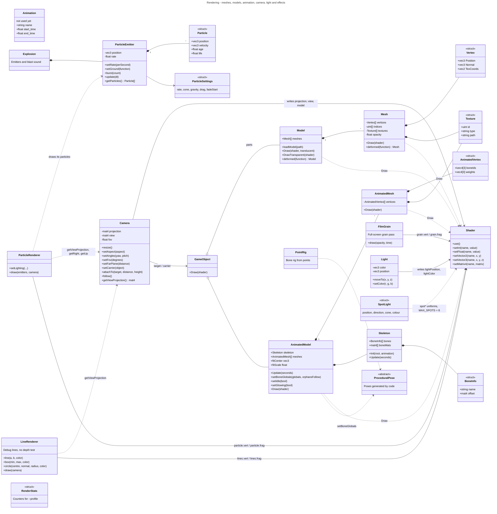

`Shader` is the meeting point: the camera, the lights and every mesh write their uniforms into it. There is one program for the world; the uniform contract is in [ARCHITECTURE.md](ARCHITECTURE.md). `unlit` selects between lit (0), sky (1), emissive (2) and procedural sky (3) per part; `Environment::canopyMask` adds the forest-canopy shadow (texture unit 7).

**Mirrors.** While driving, `main` renders the scene a second time into a small FBO for each side mirror (320×640), one mirror per frame, using a second `Camera` placed on the glass. `GameStage::rearMirror(side)` returns a `MirrorView` and the `RV` shows the texture on its mirror glass (`RV::setMirrorTexture`). The centre mirror looks out of the rear window. Flatwoods only exists in these passes.

## 6. Input and interaction

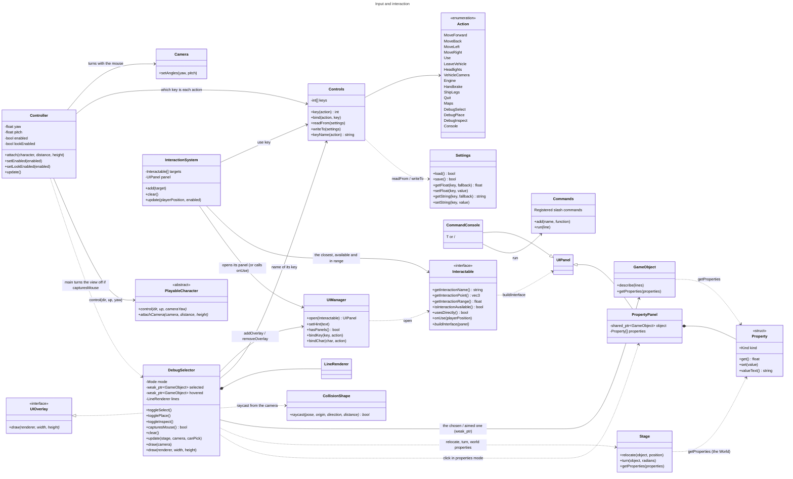

The `main` loop applies one rule: `controller.setEnabled(!ui.hasPanels() && !isPlayerDead())`. With any panel open the controls pause and the cursor is free; the world itself is **never** paused. While paralysed (`GameStage::playerImmobilized`) `main` also stops the `Controller`. `InteractionSystem` only opens a panel when none is open, and with `enabled = false` (while driving) it neither offers nor uses anything.

**Vehicle keys.** Left Shift (`Action::LeaveVehicle`) does three things: run on foot, get out of the vehicle being driven (only below 2 m/s for the RV) and, if Bob or Flatwoods hold you, break free (`leaveVehicle` → `Bob::struggleOnce` / end of possession). R (`Engine`) turns the key and starts an engine attempt, Space (`Handbrake`) pulls the handbrake (or rises in the saucer), F (`Headlights`) is the flashlight, the vehicle lights or the saucer's ray gun, Q (`ShipLegs`) retracts the saucer's legs.

**Debug modes.** `Action::DebugSelect` (key 1), `DebugPlace` (2) and `DebugInspect` (0) switch the `DebugSelector` modes. In placement mode the cross marks a floor point (`floorHit`) and a click moves the chosen object with `Stage::relocate` (which calls the virtual `teleport` and re-registers static objects in the grid); with the right button the mouse turns it (`Stage::turn`, in 15° steps with Shift). In properties mode a click opens a `PropertyPanel` with the `Property` list of the aimed object; aiming at nothing edits the World's (time, speed, day length). It is a `UIOverlay`, not a panel, so it does not pause the controls: left click casts a ray from the camera (`CollisionShape::raycast`) and the right one chooses the player. It only keeps a `weak_ptr` and `switchMap` empties it with `clear()`.

## 7. Audio and dialogue

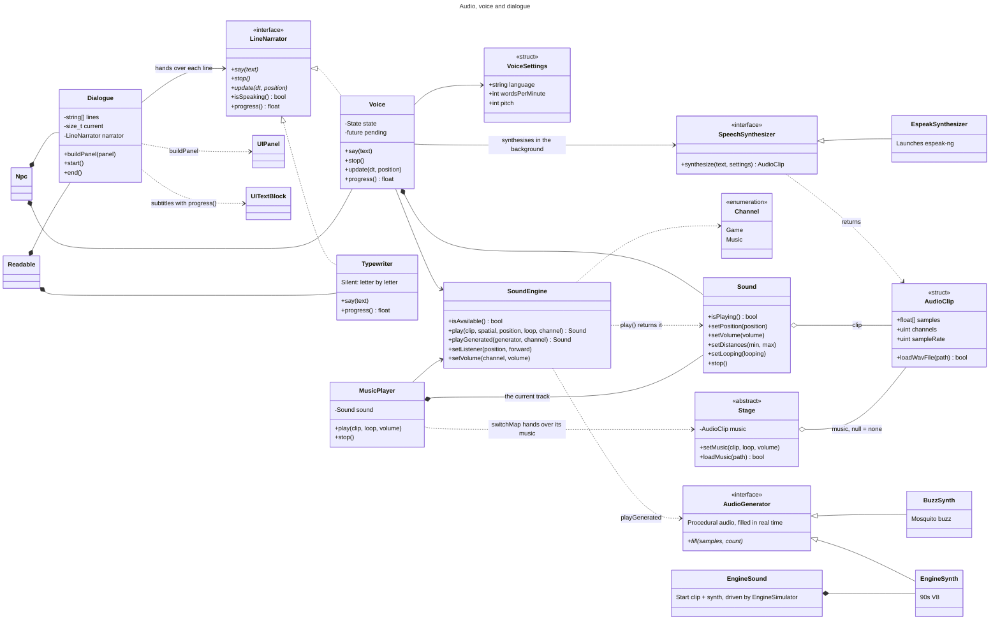

The **background music** belongs to the `Stage` (`music`, `nullptr` = none, looping by default) and is played by the `MusicPlayer` on the `Music` channel; `switchMap` hands it over when the map changes. Everything else (ambient wind, creatures, engine, the saucer's hum, steam and ray gun) is on the `Game` channel, and the two have separate volumes (`audio.music_volume`, `audio.game_volume`).

`Dialogue` does not know whether text is spoken or read: it delegates to a `LineNarrator`. `Voice` (spoken, for `Npc`s) and `Typewriter` (silent, for `Readable`s) implement it, and `progress()` makes the subtitles advance at the pace of delivery. The `SoundEngine` listener follows the camera every frame. Procedural sounds (`EngineSynth`, `BuzzSynth`) implement `AudioGenerator` and are played with `playGenerated`.

## 8. User interface and menus

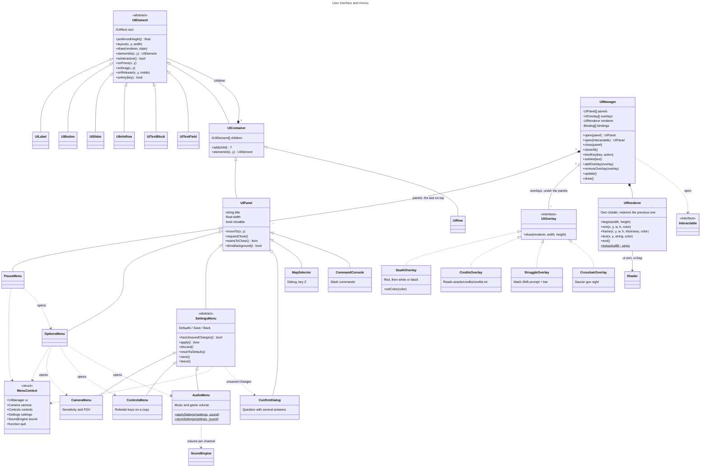

`UIManager` is the **only owner** of GLFW's keyboard and character callbacks and of the window's user pointer. It hands keys to the top panel (`onKey`); Esc closes that panel and, with none open, runs the shortcut bound with `bindKey`/`bindChar` (Esc → `PauseMenu`, Z → `MapSelector`, T or `/` → `CommandConsole`). All menus are `UIPanel`s and receive a `MenuContext` with what they need. The death, credits, struggle and crosshair screens are overlays that `main` shows on demand (death → fade to black → credits, also after an abduction).

## 9. Sequences

### 9.1 One frame

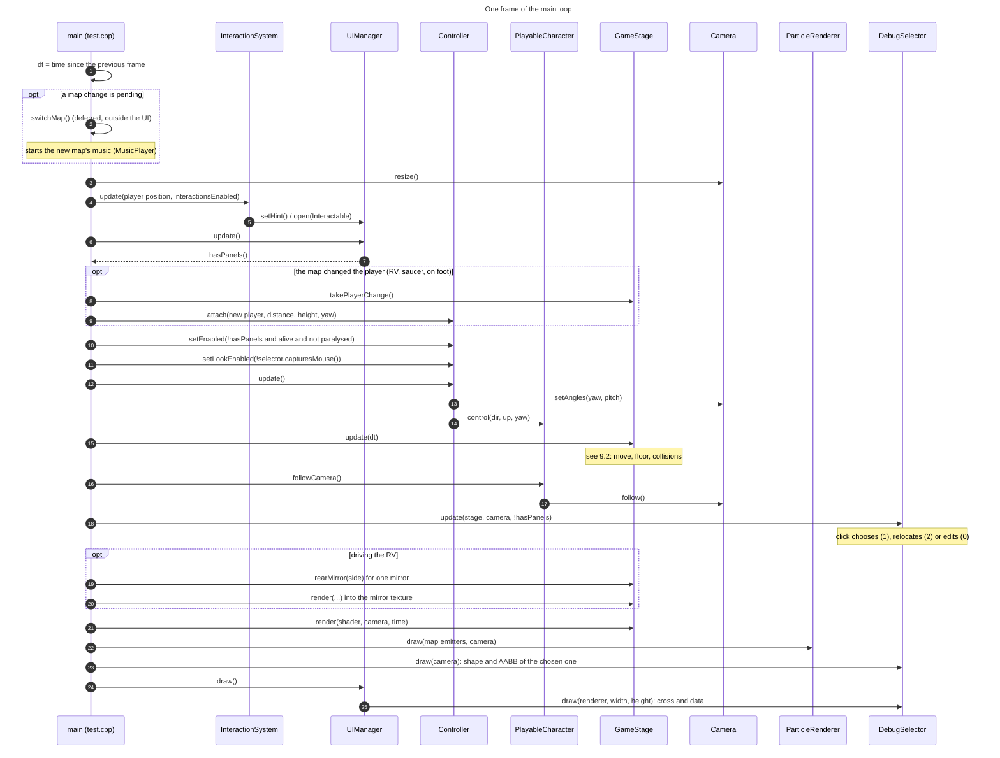

### 9.2 One frame of physics

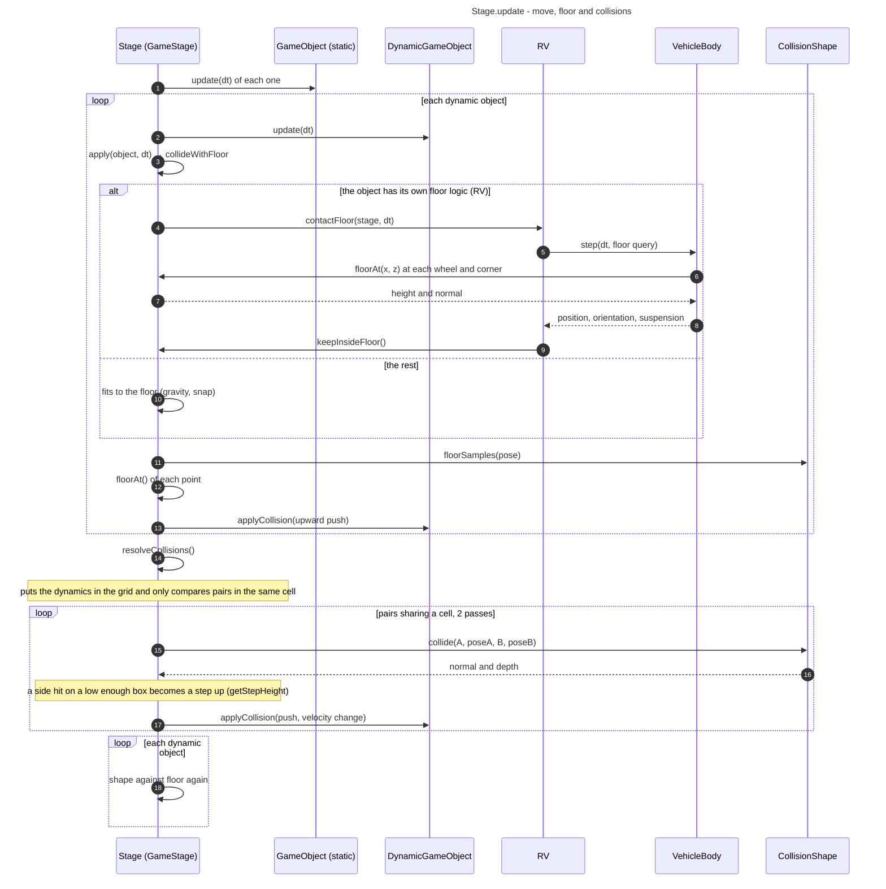

### 9.3 Talking to an NPC

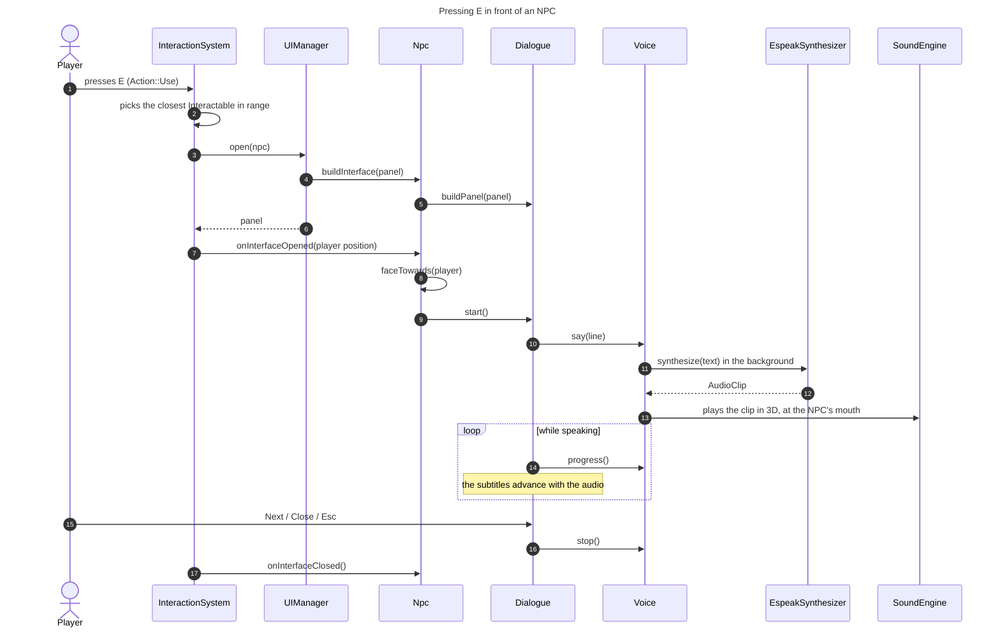

### 9.4 Getting in and out of the RV

```mermaid
---
title: Enter the RV on foot, start driving, and get out with Shift
---
sequenceDiagram
    autonumber
    actor J as Player
    participant I as InteractionSystem
    participant R as RV (door)
    participant W as RV::Steering
    participant T as VehicleStage (GameStage)
    participant K as Walker
    participant M as main (loop)
    participant C as Controller
    participant U as UIManager

    Note over J,K: starts on foot, first person
    J->>I: E next to the door (available and in range)
    I->>R: usesDirectly() → true
    I->>R: onUse(position)
    R->>R: toggleDoor() (a push; the door then swings with inertia)
    J->>K: walks in over the step (getStepHeight) and through the hollow cabin
    J->>I: E next to the steering wheel (inside, ≤ 0.9 m from the seat)
    I->>W: onUse(position)
    W->>T: enterAction → enterRV()
    T->>K: hidden, no collision or gravity
    T->>R: setOccupied(true)
    T->>T: setPlayer(rv, distance, height, yaw)
    M->>T: takePlayerChange()
    T-->>M: true
    M->>C: attach(rv, distance, height, yaw)
    C->>R: control(...) every frame, cockpit camera follows the RV
    J->>U: Left Shift (LeaveVehicle, no panels)
    U->>T: leaveVehicle() (only below 2 m/s)
    T->>R: control(0) and setOccupied(false)
    Note over R: the handbrake is not applied by itself; the engine stays on
    T->>K: next to the steering wheel, inside, with collision and gravity
    T->>T: setPlayer(walker, 0, 1.6, yaw forward)
    M->>T: takePlayerChange()
    M->>C: attach(walker, 0, 1.6, yaw)
    Note over J,K: on foot again, inside the RV (a SafeSpace)
```

## 10. Index of all classes

Built from the headers in `src/`. The last column is the section where the class appears (a `—` in *Inherits from* means no base class). Helper types that live inside another class (`Part`, `VehicleBody::Params`, `Stage::Body`, `RV::Steering`…) show in their class's diagram.

| Class | File | Inherits from | Section |
|---|---|---|---|
| `Bob` | `src/entities/Bob.h` | `DynamicGameObject` | 3 |
| `AlienVisit` | `src/entities/AlienVisit.h` | — | 3 |
| `Saucer` | `src/entities/Saucer.h` | `PlayableCharacter`, `Interactable` | 3 |
| `Flatwoods` | `src/entities/Flatwoods.h` | `DynamicGameObject` | 3 |
| `FollaCulos` | `src/entities/FollaCulos.h` | `Npc` | 3 |
| `Mosquito` | `src/entities/Mosquito.h` | `DynamicGameObject` | 3 |
| `MosquitoEgg` | `src/entities/MosquitoEgg.h` | `DynamicGameObject` | 3 |
| `NpcRagdoll` | `src/entities/NpcRagdoll.h` | — | 3 |
| `Npc` | `src/entities/Npc.h` | `DynamicGameObject`, `Interactable` | 2 |
| `Pingu` | `src/entities/Pingu.h` | `Npc` | 2 |
| `RV` | `src/entities/RV.h` | `PlayableCharacter`, `Interactable` | 2 |
| `Readable` | `src/entities/Readable.h` | `GameObject`, `Interactable` | 2 |
| `Satellite` | `src/entities/Satellite.h` | `GameObject`, `Interactable` | 2 |
| `FuelPump` | `src/entities/FuelPump.h` | `GameObject`, `Interactable` | 2 |
| `Walker` | `src/entities/Walker.h` | `PlayableCharacter` | 2 |
| `TestStage` | `src/test.cpp` | `VehicleStage` | 2 |
| `ForestStage` | `src/world/ForestStage.h` | `VehicleStage` | 2 |
| `PineForestStage` | `src/world/PineForestStage.h` | `VehicleStage` | 2 |
| `Route66Stage` | `src/world/Route66Stage.h` | `VehicleStage` | 2 |
| `VehicleStage` | `src/world/VehicleStage.h` | `GameStage` | 2 |
| `DynamicGameObject` | `src/world/DynamicGameObject.h` | `GameObject` | 2 |
| `GameObject` | `src/world/GameObject.h` | — | 2 |
| `Environment` | `src/world/GameStage.h` | — | 2 |
| `GameStage` | `src/world/GameStage.h` | `Stage` | 2 |
| `Interactable` | `src/world/Interactable.h` | — | 2 |
| `PlayableCharacter` | `src/world/PlayableCharacter.h` | `DynamicGameObject` | 2 |
| `FloorMaterial` | `src/world/FloorMaterial.h` | — | 2 |
| `MaterialMap` | `src/world/MaterialMap.h` | — | 2 |
| `MirrorView` | `src/world/MirrorView.h` | — | 5 |
| `SafeSpace` | `src/world/SafeSpace.h` | — | 2 |
| `Effect` | `src/world/SceneFile.h` | — | 2 |
| `SceneFile` | `src/world/SceneFile.h` | — | 2 |
| `SceneObject` | `src/world/SceneFile.h` | — | 2 |
| `SceneStage` | `src/world/SceneStage.h` | `GameStage` | 2 |
| `FloorMode` | `src/world/Stage.h` | — | 2 |
| `Stage` | `src/world/Stage.h` | — | 2 |
| `Property` | `src/world/Property.h` | — | 6 |
| `Box` | `src/physics/CollisionShape.h` | `CollisionShape` | 4 |
| `Capsule` | `src/physics/CollisionShape.h` | `CollisionShape` | 4 |
| `CompoundShape` | `src/physics/CollisionShape.h` | `CollisionShape` | 4 |
| `CollisionShape` | `src/physics/CollisionShape.h` | — | 4 |
| `Contact` | `src/physics/CollisionShape.h` | — | 4 |
| `Pose` | `src/physics/CollisionShape.h` | — | 4 |
| `EngineSimulator` | `src/physics/EngineSimulator.h` | — | 4 |
| `ImpactDetector` | `src/physics/ImpactDetector.h` | — | 4 |
| `VehicleBody` | `src/physics/VehicleBody.h` | — | 4 |
| `Ragdoll` | `src/physics/Ragdoll.h` | `ProceduralPose` | 3 |
| `SpiderGait` | `src/physics/SpiderGait.h` | `ProceduralPose` | 3 |
| `InsectLegs` | `src/physics/InsectLegs.h` | `ProceduralPose` | 3 |
| `ProceduralPose` | `src/render/ProceduralPose.h` | — | 3 |
| `PointRig` | `src/render/PointRig.h` | — | 5 |
| `AnimatedMesh` | `src/render/AnimatedMesh.h` | — | 5 |
| `AnimatedVertex` | `src/render/AnimatedMesh.h` | — | 5 |
| `AnimatedModel` | `src/render/AnimatedModel.h` | — | 5 |
| `Animation` | `src/render/Animation.h` | — | 5 |
| `Camera` | `src/render/Camera.h` | — | 5 |
| `Light` | `src/render/Light.h` | — | 5 |
| `SpotLight` | `src/render/SpotLight.h` | — | 5 |
| `Mesh` | `src/render/Mesh.h` | — | 5 |
| `Texture` | `src/render/Mesh.h` | — | 5 |
| `Vertex` | `src/render/Mesh.h` | — | 5 |
| `Model` | `src/render/Model.h` | — | 5 |
| `Shader` | `src/render/Shader.h` | — | 5 |
| `LineRenderer` | `src/render/LineRenderer.h` | — | 5 |
| `BoneInfo` | `src/render/Skeleton.h` | — | 5 |
| `Skeleton` | `src/render/Skeleton.h` | — | 5 |
| `ParticleEmitter` | `src/effects/ParticleEmitter.h` | — | 5 |
| `ParticleRenderer` | `src/effects/ParticleRenderer.h` | — | 5 |
| `Explosion` | `src/effects/Explosion.h` | — | 5 |
| `FilmGrain` | `src/effects/FilmGrain.h` | — | 5 |
| `RenderStats` | `src/core/RenderStats.h` | — | 5 |
| `Settings` | `src/core/Settings.h` | — | 6 |
| `Commands` | `src/core/Commands.h` | — | 6 |
| `PoissonDisk` | `src/core/PoissonDisk.h` | — | — |
| `Controller` | `src/input/Controller.h` | — | 6 |
| `Action` | `src/input/Controls.h` | — | 6 |
| `Controls` | `src/input/Controls.h` | — | 6 |
| `InteractionSystem` | `src/input/InteractionSystem.h` | — | 6 |
| `DebugSelector` | `src/debug/DebugSelector.h` | `UIOverlay` | 6 |
| `PropertyPanel` | `src/debug/PropertyPanel.h` | `UIPanel` | 6 |
| `AudioClip` | `src/audio/AudioClip.h` | — | 7 |
| `AudioGenerator` | `src/audio/AudioGenerator.h` | — | 7 |
| `BuzzSynth` | `src/audio/BuzzSynth.h` | `AudioGenerator` | 7 |
| `EngineSound` | `src/audio/EngineSound.h` | — | 7 |
| `EngineSynth` | `src/audio/EngineSynth.h` | `AudioGenerator` | 7 |
| `EspeakSynthesizer` | `src/audio/EspeakSynthesizer.h` | `SpeechSynthesizer` | 7 |
| `MusicPlayer` | `src/audio/MusicPlayer.h` | — | 7 |
| `Sound` | `src/audio/SoundEngine.h` | — | 7 |
| `SoundEngine` | `src/audio/SoundEngine.h` | — | 7 |
| `SpeechSynthesizer` | `src/audio/SpeechSynthesizer.h` | — | 7 |
| `VoiceSettings` | `src/audio/SpeechSynthesizer.h` | — | 7 |
| `Voice` | `src/audio/Voice.h` | `LineNarrator` | 7 |
| `Dialogue` | `src/dialogue/Dialogue.h` | — | 7 |
| `LineNarrator` | `src/dialogue/LineNarrator.h` | — | 7 |
| `Typewriter` | `src/dialogue/Typewriter.h` | `LineNarrator` | 7 |
| `AudioMenu` | `src/ui/AudioMenu.h` | `SettingsMenu` | 8 |
| `CameraMenu` | `src/ui/CameraMenu.h` | `SettingsMenu` | 8 |
| `CommandConsole` | `src/ui/CommandConsole.h` | `UIPanel` | 8 |
| `ConfirmDialog` | `src/ui/ConfirmDialog.h` | `UIPanel` | 8 |
| `ControlsMenu` | `src/ui/ControlsMenu.h` | `SettingsMenu` | 8 |
| `CreditsOverlay` | `src/ui/CreditsOverlay.h` | `UIOverlay` | 8 |
| `CrosshairOverlay` | `src/ui/CrosshairOverlay.h` | `UIOverlay` | 8 |
| `DeathOverlay` | `src/ui/DeathOverlay.h` | `UIOverlay` | 8 |
| `MapSelector` | `src/ui/MapSelector.h` | `UIPanel` | 8 |
| `MenuContext` | `src/ui/MenuContext.h` | — | 8 |
| `OptionsMenu` | `src/ui/OptionsMenu.h` | `UIPanel` | 8 |
| `PauseMenu` | `src/ui/PauseMenu.h` | `UIPanel` | 8 |
| `SettingsMenu` | `src/ui/SettingsMenu.h` | `UIPanel` | 8 |
| `StruggleOverlay` | `src/ui/StruggleOverlay.h` | `UIOverlay` | 8 |
| `UIButton` | `src/ui/UIButton.h` | `UIElement` | 8 |
| `UIContainer` | `src/ui/UIContainer.h` | `UIElement` | 8 |
| `UIElement` | `src/ui/UIElement.h` | — | 8 |
| `UIInfoRow` | `src/ui/UIInfoRow.h` | `UIElement` | 8 |
| `UILabel` | `src/ui/UILabel.h` | `UIElement` | 8 |
| `UIManager` | `src/ui/UIManager.h` | — | 8 |
| `UIOverlay` | `src/ui/UIOverlay.h` | — | 8 |
| `UIPanel` | `src/ui/UIPanel.h` | `UIContainer` | 8 |
| `UIRenderer` | `src/ui/UIRenderer.h` | — | 8 |
| `UIRow` | `src/ui/UIRow.h` | `UIContainer` | 8 |
| `UISlider` | `src/ui/UISlider.h` | `UIElement` | 8 |
| `UITextBlock` | `src/ui/UITextBlock.h` | `UIElement` | 8 |
| `UITextField` | `src/ui/UITextField.h` | `UIElement` | 8 |

## How to maintain this document

- If you add a class, put it in the diagram of its subsystem (with its relations; there is no need to list every member) and in the index.
- If you change an inheritance, an owner (`*--`) or an important dependency, update the arrow. This is what drifts most.
- The PNGs in `docs/diagrams/` are copies of the Mermaid blocks and need regenerating when a diagram changes (`mmdc -p cfg.json -i block.mmd -o image.png -s 2`; see `CLAUDE.md`). They are currently stale.
- The diagrams are text: edit them by hand and GitHub renders them. To check that the syntax is valid before pushing, pass each block through Mermaid's parser (`mermaid.parse`).
